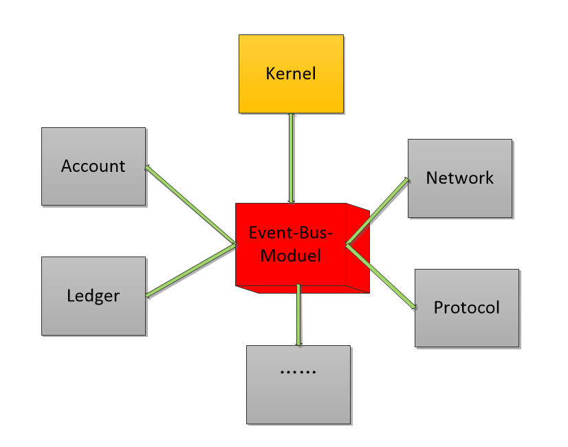
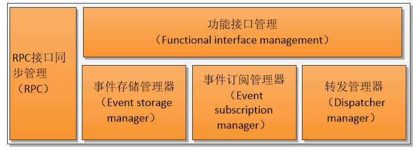
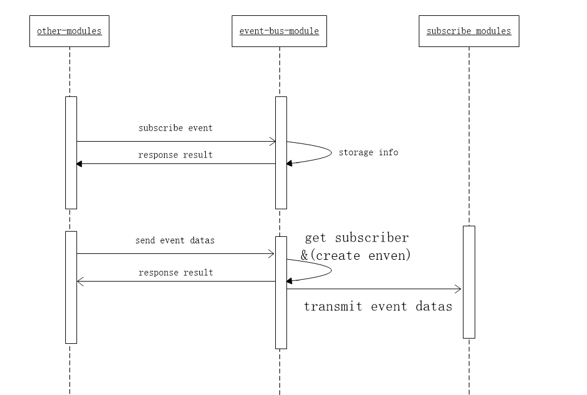
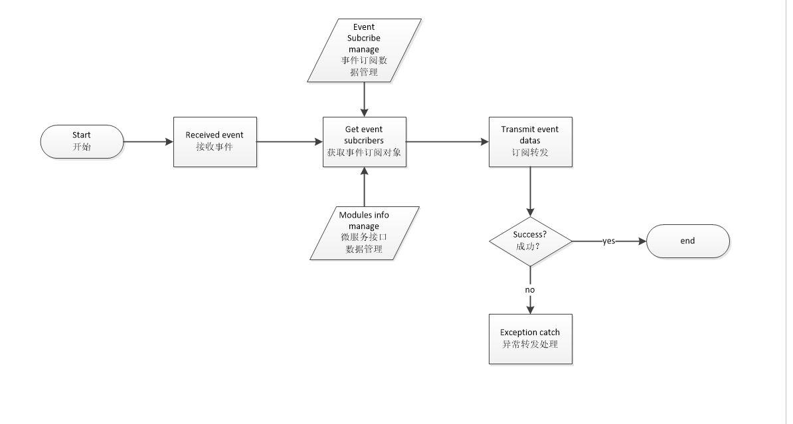

# Event bus module design document

[TOC]

## 1. Overall description

### 1.1 Module Overview

#### 1.1.1 Why should I have the Event Bus module?

> The Event Bus Module is a functional module designed to receive and notify processing module events, managing all module events.

#### 1.1.2 What is the "Event Bus"?

> Provide event subscription, receiving, sending and other functions, which is an event transfer station between modules

#### 1.1.3 Positioning of Event Bus in the System

> The event module is an edge system that provides some major asynchronous messaging, which means that even without an event bus, the system can operate normally, is lightweight, and does not depend on other module systems.

### 1.2 Architecture


- The event bus module mainly contains 2 parts of interactive logic:
  - Microservice registration and service information acquisition with the system core module.
  - Event message creation, subscription, and forwarding management with other base modules.

## 2. functional design

### 2.1 Functional Architecture


### 2.2 Module Service


> This module provides event subscriptions, event forwarding

#### 2.2.1 Modifying system operating parameters

> Only rely on the core system, the core system can start, stop, modify parameters, etc. of the event module system,

### 2.3 Module internal function


> Module internal work mainly includes, subscription manager, event manager, and forwarding manager.

- Microservice interface information synchronization management
  - for synchronizing the service interface with the kernel service management module
- Event Storage Management (eventBus)
  - Used to create event information, subscribe to other storage, and initialize the information when the module is restarted.
- Event subscription management (subscribe)
  - Maintain a "configuration table" for subscription events: including important parameters for all individual module subscriptions
- Event forwarding management (dispatcher)
  - The open interface is used for event reception, the receiving event is forwarded by subscription, and the forwarding call interface is obtained through the service information management interface.
- Function Interface Management (rpc)
  - Open query interface for external query
### 2.4 Event Bus Process

* Event processing timing



- Event processing basic process



### 2.5 Business Logic

> Exception logic processing in case of event forwarding failure (such as network reason), according to the following two logics:

- 1. Retaining event calls Repeat calls by queue until the forwarding is successful.
- 2. Discard it directly after trying many times. (Tentatively 5 times) Retry every 10 seconds.

## 3. Interface Design

### 3.1 Module Interface
#### 3.1.1 Event Theme Subscription
> cmd: subscribe

##### Parameter Description (Request body)

```json
{
  "cmd": "subscribe",
  "min_version": 1.0,
  "params":[
    "app.nuls.network.bandwidth",//topic event topic
    "moduleId" //moduleId subscriber module id
  ]
}
```
##### Return value description (Response content)

```json
{
  "version": 1.2,
  "code": 0,
  "msg": "reponse message.", // ​​information on failure
  "result": {
    "app_secret": "xxxxxxxxxxxx" // app_secret, temporarily not needed, may need to be verified later if it is not required to be called locally
  }
}
```

#### 3.1.2 Event Unsubscribe
> cmd: unsubscribe

##### Parameter Description (request body)

```json
{
  "cmd": "unsubscribe",
  "min_version": 1.0,
  "params":[
    "app.nuls.network.bandwidth", //topic event topic
    "moduleId" //moduleId subscriber module id
  ]
}
```

##### Return value description: (response content)

```json
{
  "version": 1.2,
  "code": 0,
  "msg": "reponse message.", // ​​information on failure
  "result": {
  }
}
```

#### 3.1.3 Event Sending [Automatically Create Topic]
> Do you keep a certain amount of time when no one is subscribed?

> cmd: send

##### Parameter description (request body)

```json
{
 "cmd": "send",
 "min_version": 1.0,
 "params":[
   "app.nuls.network.bandwidth",//topic event topic
   "moduleId", //moduleId subscriber module id
   {"key" : "data value"} // event to be sent, jsonObj
 ]
}
```

##### return value description (response content)

```json
{
  "version": 1.2,
  "code": 0,
  "msg": "reponse message.", // ​​information on failure
  "result": {
  }
}
```
#### 3.1.4 Event broadcast (push push or dispatcher)
> I need each interface to provide an interface when subscribing to events. I can call it when I broadcast. I am using multithreading to remove your interface. You need to return the correct code, otherwise there will be a retry mechanism.

##### Parameter description (request body)

```json
{
 "cmd": "dispatcher",
 "min_version": 1.0,
 "params":[
   {} //data event to be sent, payload
 ]
}
```

##### return value description (response content)

```json
{
  "version": 1.2,
  "code": 0, // ​​must return correctly, do not need to tell you whether the business logic is wrong, as long as you receive it, tell me that you have successfully received it.
  "msg": "reponse message.", // ​​information on failure
  "result": {
  }
}
```
### 3.2 Function Interface
> The functional interface is the interface provided to the interface and command line tools

#### Get event topic information
> cmd: topics

##### Parameter description (request body)

```json
{
 "jsonrpc": "1.0",
 "method": "topics",
 "params":[]
}
```

##### Response Body (response content)

```json
{
  "version": 1.2,
  "code": 0, // ​​must return correctly, do not need to tell you whether the business logic is wrong, as long as you receive it, tell me that you have successfully received it.
  "msg": "reponse message.", // ​​information on failure
  "result": {
    "topics":[{
        "topic": "", //topic id
        "createTime":"", //Create time
        "moduleId":"", // theme creator (module) Id
        "subscribes":[//subscriber information
            {
                "moduleId":"", //subscriber
                "subscribeTime":"" //Subscription time
            }
        ]}
    ]
  }
}
```

#### Get event topic information (including all event information on this topic?) Every event I don't care about.
> cmd : get_topic

## 4. Description of the event

> does not depend on any events

## 5. agreement

### 5.1 Network Communication Protocol

no

### 5.2 Trading Agreement

## 6. Module Configuration
### 6.1 Configuration Instructions
> General support configuration, port, number of retries, retry time, thread pool size of default executor, network call timeout configuration, etc.
```yml
Server:
  Ip: 127.0.0.1 // local ip, used to provide services to other modules, you can not fill, the default is automatically obtained
  Port: 8080 //The port that provides the service, you can leave it blank, the default is automatically obtained.
```
### 6.2 Module Dependencies

- Kernel module
  - Module registration
  - Module logout
  - Module status escalation (heartbeat)
  - Service interface data acquisition and timing update

## 7. Java-specific design

> Core object class definition, storing data structures, ...

## 8. supplementary content

> Required content not covered above