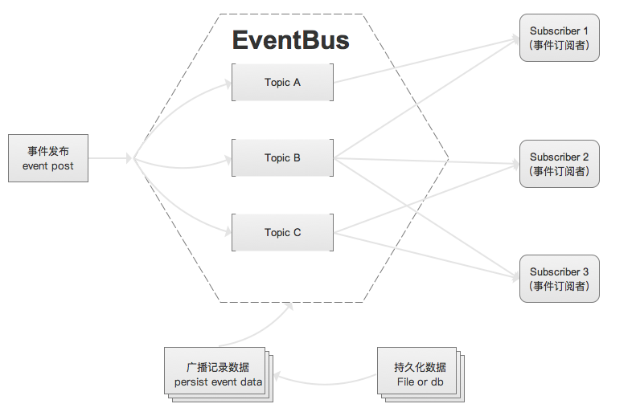

# 事件总线模块设计文档

[TOC]

## 一、总体描述

### 1.1 模块概述

#### 1.1.1 为什么要有《事件总线》模块

[^说明]: 事件总线模块是专门用来接收及通知处理模块事件的功能性模块，管理着所有模块事件。

#### 1.1.2 《事件总线》要做什么

[^说明]: 提供事件的订阅、接收、发送等功能，是模块间的事件中转站

#### 1.1.3 《事件总线》在系统中的定位

[^说明]: 事件模块是一个边缘系统，提供主要一些异步的消息发送，也就说，即使没有事件总线，系统一样可以正常运行，比较轻量级，而且不依赖其他模块系统。

### 1.2 架构图

- 事件总线模块主要含2部分交互逻辑：
  - 与系统核心模块的微服务注册与服务信息获取。
  - 与其他基础模块间的事件消息创建、订阅、转发管理。

## 二、功能设计

### 2.1 功能架构图

### 2.2 模块服务

[^说明]: 该模块提供事件的订阅，事件的转发

#### 2.2.1 修改系统运行参数

  [^说明]: 只依赖核心系统，核心系统可以对事件模块系统的启动，停止，参数修改等，

### 2.3 模块内部功能

[^说明]: 模块内部工能主要包含，订阅管理器，事件管理器，转发管理器。

## 四、事件说明

[^说明]: 不依赖任何事件

## 五、协议

### 5.1 网络通讯协议

无

### 5.2 交易协议

## 六、模块配置

[^说明]: 本模块必须要有的配置项

## 七、Java特有的设计

[^说明]: 核心对象类定义,存储数据结构，......

## 八、补充内容

[^说明]: 上面未涉及的必须的内容

